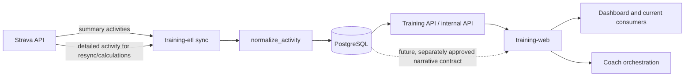

# Strava Architecture

## Purpose and scope

This document grounds the personal, single-user Training Intelligence integration with Strava. It describes the current repository ownership, authentication, ingestion, persistence, consumer boundaries, and operational guardrails. It also records the current investigation status for activity descriptions and private notes.

Repository source and the current official Strava developer documentation take precedence over stale prose, generated clients, cached assumptions, and prior reports. Planned behavior and unresolved questions in this document are not current system behavior.

## Repository and service ownership

`training-etl` owns Strava ingestion, OAuth token refresh, activity normalization, ETL-managed PostgreSQL writes, schema SQL, Daily and Weekly rebuilds, targeted activity resync, and the authenticated Training API boundary.

`training-web` owns FastAPI browser routes, dashboard presentation, static frontend behavior, Coach orchestration and provider integration, Coach receipts, and web-owned search or export presentation. It consumes approved Training API or database-backed contracts and does not own Strava ingestion or ETL calculations.

PostgreSQL is the durable system of record. `strava_activities` is the authoritative activity-level source for Training Intelligence. Ingestion and persistence are separate from API exposure, UI display, search, export, and Coach context. Current consumers do not receive activity narrative through a default contract.

## Authentication and token lifecycle

The ETL reads Strava client credentials and a refresh token from environment-owned configuration in `src/settings.py`. The token exchange is implemented in `src/strava_client.py` with a POST to the Strava token URL using the refresh-token grant.

`refresh_access_token()` returns the token response to the caller, and current sync flows use the returned access token for subsequent requests. The implementation does not persist the returned granted `scope` metadata. No statically configured requested-scope list was verified in the current ETL configuration, so the currently granted scope is not proven by repository state.

Secrets, refresh tokens, access tokens, authorization headers, and environment values must remain outside logs, reports, fixtures, and ordinary errors. Token refresh occurs before activity retrieval; no OAuth reauthorization or scope expansion is part of the current implementation.

Known gaps are scope observability, explicit scope configuration, and a documented deauthorization or token-revocation flow.

## Activity ingestion architecture

Normal sync uses `GET /athlete/activities` with a bounded rolling UTC time window, pagination up to 200 records per request, and a short inter-page delay. The response is normalized by `normalize_activity()` and passed to the existing Daily, Weekly, gear, and database-writing paths.

Detailed retrieval uses `GET /activities/{id}?include_all_efforts=false` through `fetch_activity_detail()`. Targeted activity resync fetches detail before opening the PostgreSQL write transaction, normalizes the response, compares it with the stored row, upserts the activity, and rebuilds affected derived data. Daily-building code also uses detailed activity and stream endpoints for existing RPE and heart-rate calculations where applicable.

The canonical writer performs activity upserts and derived rebuild work on one database connection and commits atomically. Targeted resync uses a transaction-level advisory lock and explicit commit or rollback behavior. External provider calls are outside the database write transaction.

The current normalizer retains standard activity identity, date, name, sport, duration, distance, elevation, heart-rate, gear, and classification fields. It does not retain description or a private-note field. The `raw_json` column stores JSON serialized from the normalized activity dictionary; it is not the provider-original response and is not a narrative contract.

## Data flow

The solid path is current behavior. The dotted narrative path is planned only; no description or private-note field is currently normalized, persisted, exposed, searched, exported, or sent to Coach.

## Current database contract

`public.strava_activities` stores one canonical row per activity, keyed by `activity_id`. Current relevant fields include local activity date, name, sport and category, duration, distance, elevation, heart-rate summaries, gear identifiers, normalized `raw_json`, and `updated_at`.

Daily and Weekly builders, gear aggregation, targeted resync, the Training API, and selected web routes depend on this activity-level source. Derived tables must be rebuilt from the complete persisted authoritative set rather than treating a bounded provider response as complete history.

Some existing reads use broad row selection, including `SELECT *` in targeted-resync support code. Any future sensitive columns require explicit query and serializer review before they can be safely exposed. Full PostgreSQL backups include the complete `strava_activities` table, including `raw_json`; backup retention and account-disconnect deletion would therefore be operational concerns for any future narrative storage.

No narrative schema change is current behavior, and this document does not prescribe a migration.

## Current API and consumer surfaces

The ETL-side Training API and internal API provide bounded, authenticated training data and approved ETL operations. The web application uses those boundaries and selected database-backed routes for dashboard presentation. Current activity search is limited and does not search narrative. No dedicated local activity-detail narrative route or explicit narrative export contract was verified.

Current Coach context assembly is bounded and source-labeled. Context receipts store allowlisted metadata and coverage, not prompts, raw provider payloads, or narrative bodies. Narrative is not currently part of Coach context.

Operational logs record activity counts, names, dates, and calculated metrics in existing paths. Descriptions and private notes are not intentionally logged today. `http_json()` currently includes decoded provider error bodies in HTTP exception messages; this is a future sensitive-data risk and should not be expanded into narrative handling.

## Description and private-note investigation status

The currently verified official Strava API reference associates `description` with detailed activity retrieval. Summary activity retrieval does not currently provide the desired narrative contract, so normal list-only sync cannot populate descriptions.

The public API contract reviewed on 2026-09-23 did not establish an exact private-note field, endpoint, OAuth scope, availability rule, edit behavior, or clearing semantics. Private-note support must not be claimed without direct official documentation or a separately authorized, sanitized API probe.

The eventual product target is every locally stored Strava activity since 2012, not only rides. The supplied handoff identifies approximately 3,860 activities; that is a supplied planning count, not a repository- or database-independent measurement verified during this investigation.

Description ingestion, private-note feasibility, search/export, and Coach use are separate decisions. Uncertainty in a later consumer does not by itself invalidate the technical investigation of bounded ingestion, but Coach use requires a later isolated architecture and product decision.

## Strava API change procedure

**Mandatory rule:** Before making any Strava API-related code, schema, OAuth, endpoint, field, webhook, rate-limit, retention, or integration change, the engineer or coding agent must first check the current official Strava developer documentation and API reference. Do not rely on repository memory, old generated clients, prior investigation reports, or cached assumptions. Record the access date and relevant official contract findings in the implementation report or pull request.

As applicable, check the official API reference, authentication and OAuth documentation, rate-limit documentation, webhook documentation, changelog, API agreement, and API policy when the change affects data use, retention, disclosure, or AI integration. Documentation verification is required before implementation, not on every normal runtime sync.

Never expose credentials while checking documentation or testing behavior. If the official contract is ambiguous, propose a bounded sanitized API probe and obtain explicit authorization before running it. Do not bypass authentication, consent, endpoint restrictions, or rate limits.

## Known policy issue, non-blocking by current product decision

The current Strava API Policy contains broad restrictions related to AI use, persistent storage, retention, disclosure, and deletion. In particular, the reviewed policy addresses AI grounding and context use, persistent indexes, third-party transfer, user deletion, and deauthorization.

Mike is aware of this concern and has decided that, for this personal single-user project, it is documented but is not a blocker to the current technical investigation or future product decision. This is a product-owner risk decision, not a legal conclusion. Future commercial use, multi-user use, external distribution, or AI-provider changes require renewed review.

## Operational and privacy guardrails

- Never log secrets, authorization headers, raw provider response bodies, descriptions, or private notes.
- Do not place potentially sensitive provider response bodies in ordinary exception messages.
- Keep narrative out of ordinary logs, default API responses, default exports, and broad serializers.
- Use explicit API and serializer allowlists for sensitive fields.
- Make external calls rate-aware and preserve idempotent writes.
- Do not interpret omitted fields, failed retrieval, scope-limited responses, or transient errors as affirmative source clearing.
- Keep provider calls outside database write transactions unless an explicitly approved consistency design changes that rule.
- Treat deletion and deauthorization propagation as current gaps requiring a future design; documenting those gaps does not stop this investigation.

## Known gaps and future decisions

- Determine how granted OAuth scopes can be observed safely without exposing secrets.
- Establish whether a private-note field exists and what scope and privacy rules govern it.
- Decide whether webhook, polling, deauthorization, and deletion handling are required.
- Compare the smallest safe narrative persistence design before changing schema.
- Define incremental refresh semantics for omitted, empty, cleared, unavailable, and failed states.
- Design a previewable, checkpointed, rate-aware full-history backfill for approximately 3,860 supplied local activities since 2012.
- Decide separately whether narrative belongs in activity detail, search, explicit export, Maintenance Readiness, or bounded Coach context.
- Revisit the documented policy concern before commercial, multi-user, externally distributed, or changed AI-provider use.
Strava intends AI interaction with Strava Data to occur through its official Strava MCP, allowing personal use while protecting its data from unauthorized AI ingestion, grounding, and redistribution.
Maintaining a persistent cached copy of Strava Data would effectively prevent compliant commercialization of Training Intelligence under the current Strava API Policy, so any future commercial or multi-user offering would require a different data-source and retention architecture.