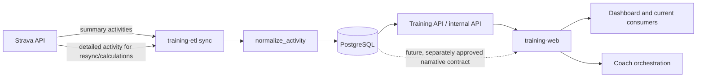

# Strava Architecture

## Purpose and scope

This document grounds the personal, single-user Training Intelligence integration with Strava. It describes the current repository ownership, authentication, ingestion, persistence, consumer boundaries, and operational guardrails. It also records the current investigation status for activity descriptions and private notes.

Repository source and the current official Strava developer documentation take precedence over stale prose, generated clients, cached assumptions, and prior reports. Planned behavior and unresolved questions in this document are not current system behavior.

## Repository and service ownership

`training-etl` owns Strava ingestion, OAuth token refresh, activity normalization, ETL-managed PostgreSQL writes, schema SQL, Daily and Weekly rebuilds, targeted activity resync, and the authenticated Training API boundary.

`training-web` owns FastAPI browser routes, dashboard presentation, static frontend behavior, Coach orchestration and provider integration, Coach receipts, and web-owned search or export presentation. It consumes approved Training API or database-backed contracts and does not own Strava ingestion or ETL calculations.

PostgreSQL is the durable system of record. `strava_activities` is the authoritative activity-level source for Training Intelligence. Ingestion and persistence are separate from API exposure, UI display, search, export, and Coach context. Current consumers do not receive activity narrative through a default contract.

## Authentication and token lifecycle

The ETL reads Strava client credentials and a refresh token from environment-owned configuration in `src/settings.py`. The token exchange is implemented in `src/strava_client.py` with a POST to the Strava token URL using the refresh-token grant.

`refresh_access_token()` returns the token response to the caller, and current sync flows use the returned access token for subsequent requests. The implementation does not persist the returned granted `scope` metadata. No statically configured requested-scope list was verified in the current ETL configuration, so the currently granted scope is not proven by repository state.

Secrets, refresh tokens, access tokens, authorization headers, and environment values must remain outside logs, reports, fixtures, and ordinary errors. Token refresh occurs before activity retrieval; no OAuth reauthorization or scope expansion is part of the current implementation.

Known gaps are scope observability, explicit scope configuration, and a documented deauthorization or token-revocation flow.

## Activity ingestion architecture

Normal sync uses `GET /athlete/activities` with a bounded rolling UTC time window, pagination up to 200 records per request, and a short inter-page delay. The response is normalized by `normalize_activity()` and passed to the existing Daily, Weekly, gear, and database-writing paths.

Detailed retrieval uses `GET /activities/{id}?include_all_efforts=false` through `fetch_activity_detail()`. Targeted activity resync fetches detail before opening the PostgreSQL write transaction, normalizes the response, compares it with the stored row, upserts the activity, and rebuilds affected derived data. Daily-building code also uses detailed activity and stream endpoints for existing RPE and heart-rate calculations where applicable.

The canonical writer performs activity upserts and derived rebuild work on one database connection and commits atomically. Targeted resync uses a transaction-level advisory lock and explicit commit or rollback behavior. External provider calls are outside the database write transaction.

The current normalizer retains standard activity identity, date, name, sport, duration, distance, elevation, heart-rate, gear, and classification fields. The list endpoint supplies SummaryActivity, so normal sync performs one bounded detail request for each genuinely new activity after structured persistence; known activities receive no repeated detail request. The detail response supplies the allowlisted narrative fields, which are persisted through the separate omission-safe narrative writer. A detail or narrative failure is isolated from structured ingestion and does not stop later new-activity enrichment. The `raw_json` column stores JSON serialized from the normalized activity dictionary; it is not the provider-original response and is not a narrative contract.

### Current application limits

The current Strava application limits are:

- Overall rate limit: 400 requests per 15 minutes and 4,000 requests per day.
- Read rate limit: 200 requests per 15 minutes and 2,000 requests per day.
- Athletes allowed to connect: 10.
- Athletes currently connected: 1.

Backfill and detail-fetch planning must use the read limits, account for normal sync and calculation calls, and remain within the connected-athlete allowance.

## Data flow



The solid path is current behavior. Targeted activity resync reuses its one DetailedActivity response for both structured normalization and narrative extraction. Narrative-only changes do not enter changed-field classification and therefore do not rebuild Daily, Weekly, or Fitness/Fatigue/Form aggregates. Historical narrative backfill remains a standalone maintenance and recovery utility; normal sync does not perform historical backfill or broad retries. Narrative remains unexposed, unsearched, unexported, and outside Coach context.

## Current database contract

`public.strava_activities` stores one canonical row per activity, keyed by `activity_id`. Current relevant fields include local activity date, name, sport and category, duration, distance, elevation, heart-rate summaries, gear identifiers, normalized `raw_json`, and `updated_at`.

Daily and Weekly builders, gear aggregation, targeted resync, the Training API, and selected web routes depend on this activity-level source. Derived tables must be rebuilt from the complete persisted authoritative set rather than treating a bounded provider response as complete history.

Some existing reads use broad row selection, including `SELECT *` in targeted-resync support code. Any future sensitive columns require explicit query and serializer review before they can be safely exposed. Full PostgreSQL backups include the complete `strava_activities` table, including `raw_json`; backup retention and account-disconnect deletion would therefore be operational concerns for any future narrative storage.

Slice 1 has an additive, manually applied SQL artifact at `sql/strava_activity_narrative_v1.sql` and a separate destructive rollback at `sql/strava_activity_narrative_v1_rollback.sql`. It adds nullable `description` and `private_note` text columns, per-field `*_observed` booleans, and `narrative_observed_at`. Omitted fields preserve the stored value and observation state; `null`, empty, and whitespace-only values clear the field and mark that field observed; nonempty strings preserve exact Unicode and line breaks; malformed values abort the whole activity before a database transaction; failed detail fetches preserve stored data. The writer allowlists only `description` and `private_note`, parameterizes values, and updates the shared observation timestamp only when at least one approved field is observed and persisted. The pilot independently commits each activity. It does not rebuild Daily, Weekly, load, fitness/fatigue/form, TID, audit, yearly, or other aggregates.

The pilot entry point is `src/strava_narrative_pilot.py`. Preview is local-only and accepts one to three repeatable IDs:

```text
python /app/strava_narrative_pilot.py --activity-id 20302298948 --activity-id 19880001202 --activity-id 18534000278 --preview
python /app/strava_narrative_pilot.py --activity-id 20302298948 --activity-id 19880001202 --activity-id 18534000278 --apply
```

Apply refreshes the token once, makes at most three detail calls, and emits one sanitized JSON object per activity followed by a sanitized JSON summary object. Output contains only IDs, request/persistence outcomes, allowlisted failure classes, field states, observation flags, counts, and timestamps. It does not print narrative text, response bodies, names, athlete data, route data, or credentials. SQL is not included in the current ETL deployment package; apply it separately after review. A full-history backfill is not part of Slice 1.

### Slice 2 historical backfill

`src/strava_narrative_backfill.py` is the restartable historical backfill entry point. It uses `narrative_observed_at` as its durable activity-level checkpoint: by default, an activity is eligible only when that timestamp is null. A successful, well-formed detailed response checkpoints the activity even when optional narrative keys are omitted; omitted keys preserve their text and field-observed booleans. The field booleans retain provider-key presence semantics and are reported separately from completed backfill inspections. The default scope is `2012-01-01` through the current date, ordered newest first by `date_local DESC, activity_id DESC` so recent narrative becomes available first. Date filters and repeatable targeted activity IDs are supported. `--refresh-observed` deliberately removes the checkpoint predicate and therefore spends quota on already inspected rows.

The CLI defaults to batches of 100, allows at most 150, and preserves 400 daily read requests as headroom, with a configurable minimum of 200. It prefers Strava's read-specific `X-ReadRateLimit-Limit` and `X-ReadRateLimit-Usage` headers, falling back to overall headers only when read headers are unavailable. Without headers it uses conservative local request accounting and pacing. It stops before the daily headroom boundary, before the short-window boundary, at `--max-requests`, and immediately on HTTP 429. The short-lived access token is refreshed once after a 401. Only network failures and 5xx responses retry, with bounded exponential backoff; retry exhaustion re-raises the original typed failure so safe status classification is preserved. 403, 404, malformed payloads, and schema/database failures preserve local data and do not receive broad retries. A database failure stops further provider calls.

Apply acquires a non-blocking PostgreSQL session advisory lock specific to this backfill. A second apply exits before token refresh or any Strava call. Selection transactions close before provider calls, and each narrative write uses the existing allowlisted writer in an independent transaction. No Daily, Weekly, Load, Fitness/Fatigue/Form, TID, audit, yearly, or other aggregate rebuild runs. JSON Lines output contains activity IDs, outcomes, allowlisted failure classes, field states, retry counts, safe numeric rate metadata, and summaries only; it never contains narrative text, names, raw responses, routes, credentials, or SQL. Summary success requires a completed request and an accepted persistence outcome (`updated`, `checkpointed`, or `no_observed_fields`). A quota boundary record is excluded from success and failure counts; a 429 is counted as an attempted stopped request, while a stop before the next request is neither attempted nor failed. Permanent 403/404 failures remain eligible on a later default run because this slice adds no terminal-failure table.

Preview is read-only and makes no Strava calls or writes:

```text
python /app/strava_narrative_backfill.py --preview
python /app/strava_narrative_backfill.py --apply --batch-size 100
python /app/strava_narrative_backfill.py --apply --activity-id 20302298948 --activity-id 19880001202
```

Operators should avoid deploying or restarting the ETL container during an active backfill or normal sync. A quota stop leaves completed activities committed; rerun the same default command on the next UTC quota day. Inspect the final sanitized summary and database coverage queries before increasing the batch or using `--refresh-observed`.

## Current API and consumer surfaces

The ETL-side Training API and internal API provide bounded, authenticated training data and approved ETL operations. The web application uses those boundaries and selected database-backed routes for dashboard presentation. Current activity search is limited and does not search narrative. The web repository now owns a narrow read-only `/api/activities/{activity_id}/narrative` route for on-demand Daily display; there is still no narrative export or search contract.

Current Coach context assembly is bounded and source-labeled. Context receipts store allowlisted metadata and coverage, not prompts, raw provider payloads, or narrative bodies. Narrative is not currently part of Coach context.

Operational logs record activity counts, names, dates, and calculated metrics in existing paths. Descriptions and private notes are not intentionally logged today. `http_json()` currently includes decoded provider error bodies in HTTP exception messages; this is a future sensitive-data risk and should not be expanded into narrative handling.

## Description and private-note investigation status

The currently verified official Strava API reference associates `description` with detailed activity retrieval. Summary activity retrieval does not currently provide the desired narrative contract, so normal list-only sync cannot populate descriptions. Official documentation was checked on 2026-09-23: the activity reference documents `GET /activities/{id}` and `DetailedActivity.description`; authentication documents refresh-token exchange and six-hour access-token expiry; rate-limit documentation documents overall and read-specific `X-RateLimit-*` and `X-ReadRateLimit-*` headers, daily reset at midnight UTC, and HTTP 429 behavior; the changelog records the current 2026 API changes and the planned 2027 base URL change. The backfill uses the current headers and existing API base URL without changing normal sync.

The public API contract reviewed on 2026-09-23 did not establish an exact private-note field, endpoint, OAuth scope, availability rule, edit behavior, or clearing semantics. Private-note support must not be claimed without direct official documentation or a separately authorized, sanitized API probe.

The eventual product target is every locally stored Strava activity since 2012, not only rides. The supplied handoff identifies approximately 3,860 activities; that is a supplied planning count, not a repository- or database-independent measurement verified during this investigation.

Slice 1 verified description extraction from the documented `DetailedActivity` model and treats `private_note` as an optional allowlisted key without claiming it is an official documented field. Description ingestion, private-note feasibility, search/export, and Coach use are separate decisions. Uncertainty in a later consumer does not by itself invalidate bounded ingestion, but Coach use requires a later isolated architecture and product decision.

## Strava API change procedure

**Mandatory rule:** Before making any Strava API-related code, schema, OAuth, endpoint, field, webhook, rate-limit, retention, or integration change, the engineer or coding agent must first check the current official Strava developer documentation and API reference. Do not rely on repository memory, old generated clients, prior investigation reports, or cached assumptions. Record the access date and relevant official contract findings in the implementation report or pull request.

As applicable, check the official API reference, authentication and OAuth documentation, rate-limit documentation, webhook documentation, changelog, API agreement, and API policy when the change affects data use, retention, disclosure, or AI integration. Documentation verification is required before implementation, not on every normal runtime sync.

Never expose credentials while checking documentation or testing behavior. If the official contract is ambiguous, propose a bounded sanitized API probe and obtain explicit authorization before running it. Do not bypass authentication, consent, endpoint restrictions, or rate limits.

## Known policy issue, non-blocking by current product decision

The current Strava API Policy contains broad restrictions related to AI use, persistent storage, retention, disclosure, and deletion. In particular, the reviewed policy addresses AI grounding and context use, persistent indexes, third-party transfer, user deletion, and deauthorization.

Mike is aware of this concern and has decided that, for this personal single-user project, it is documented but is not a blocker to the current technical investigation or future product decision. This is a product-owner risk decision, not a legal conclusion. Future commercial use, multi-user use, external distribution, or AI-provider changes require renewed review.

## Operational and privacy guardrails

- Never log secrets, authorization headers, raw provider response bodies, descriptions, or private notes.
- Do not place potentially sensitive provider response bodies in ordinary exception messages.
- Keep narrative out of ordinary logs, default API responses, default exports, and broad serializers.
- Use explicit API and serializer allowlists for sensitive fields.
- Make external calls rate-aware and preserve idempotent writes.
- Do not interpret omitted fields, failed retrieval, scope-limited responses, or transient errors as affirmative source clearing.
- Keep provider calls outside database write transactions unless an explicitly approved consistency design changes that rule.
- Treat deletion and deauthorization propagation as current gaps requiring a future design; documenting those gaps does not stop this investigation.

## Known gaps and future decisions

- Determine how granted OAuth scopes can be observed safely without exposing secrets.
- Establish whether a private-note field exists and what scope and privacy rules govern it.
- Decide whether webhook, polling, deauthorization, and deletion handling are required.
- Compare the smallest safe narrative persistence design before changing schema.
- Define incremental refresh semantics for omitted, empty, cleared, unavailable, and failed states.
- Design a previewable, checkpointed, rate-aware full-history backfill for approximately 3,860 supplied local activities since 2012.
- Decide separately whether narrative belongs in activity detail, search, explicit export, Maintenance Readiness, or bounded Coach context.
- Revisit the documented policy concern before commercial, multi-user, externally distributed, or changed AI-provider use.
Strava intends AI interaction with Strava Data to occur through its official Strava MCP, allowing personal use while protecting its data from unauthorized AI ingestion, grounding, and redistribution.
Maintaining a persistent cached copy of Strava Data would effectively prevent compliant commercialization of Training Intelligence under the current Strava API Policy, so any future commercial or multi-user offering would require a different data-source and retention architecture.